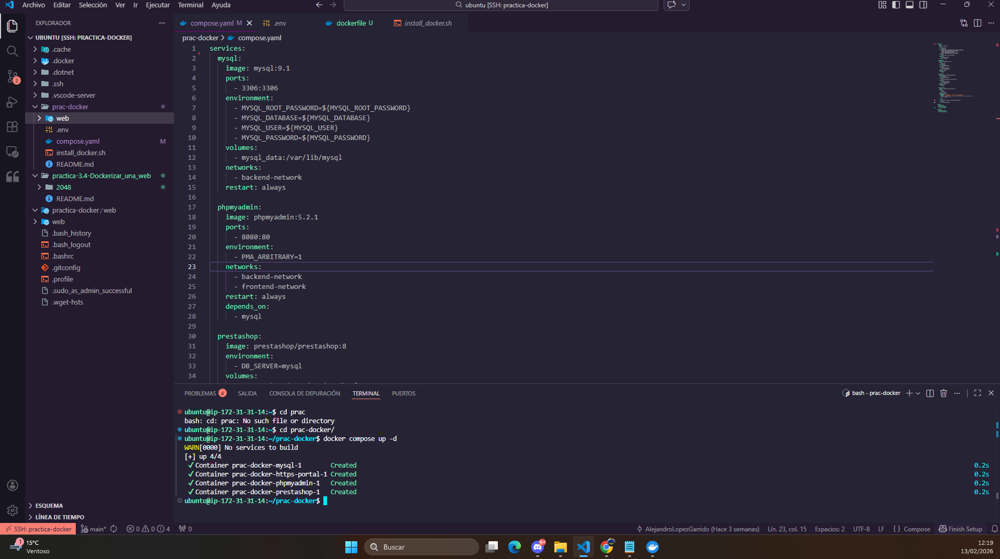
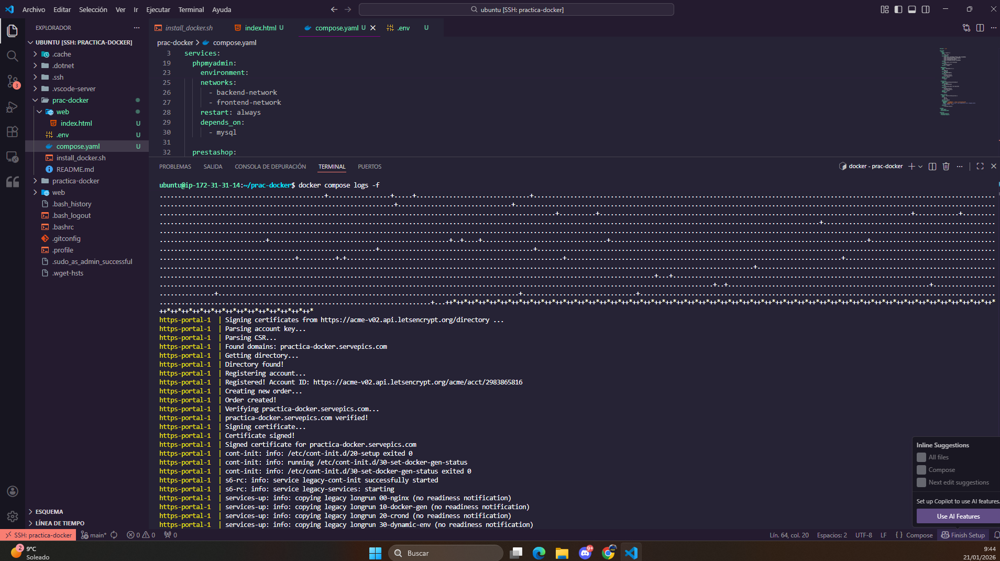
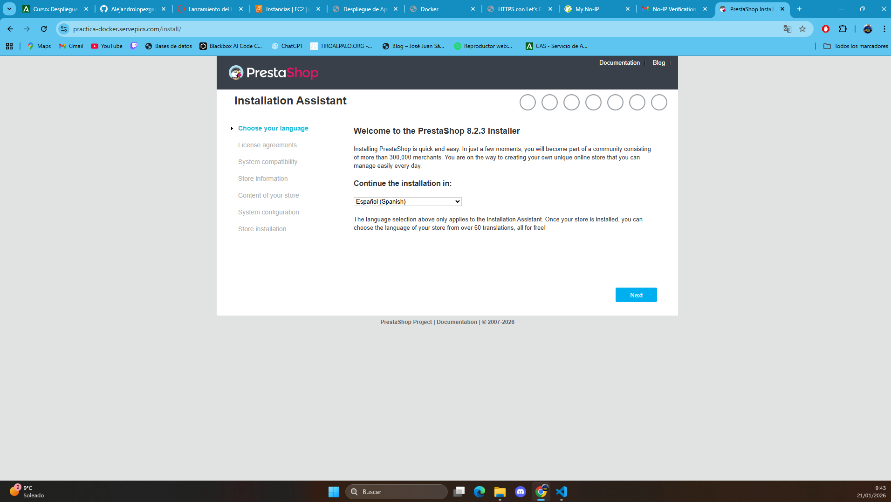
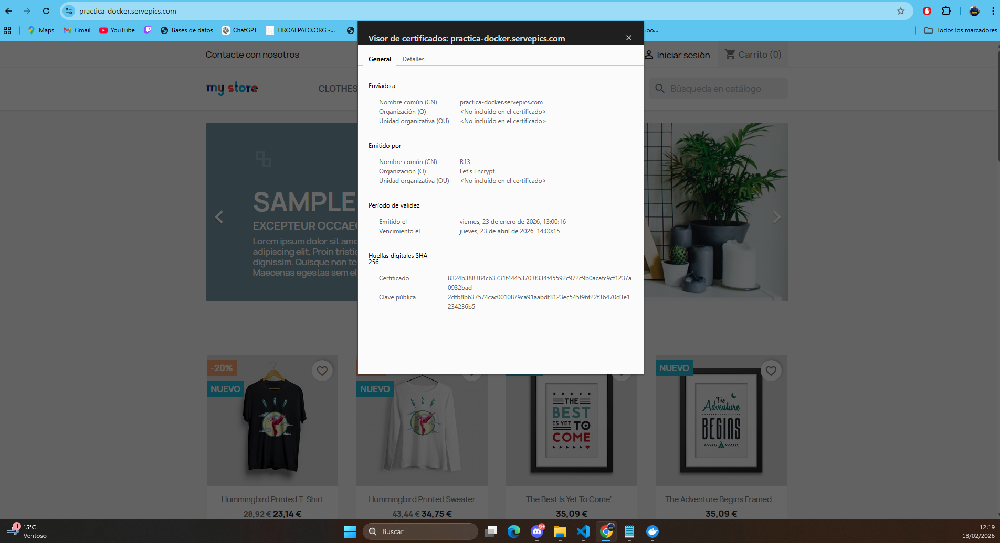
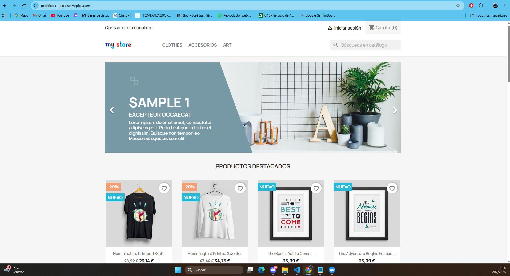

# 🛒 PrestaShop Deployment con Docker & HTTPS-Portal


Este repositorio contiene la configuración necesaria para desplegar una tienda **PrestaShop 8** de forma segura, utilizando **HTTPS-Portal** (Nginx + Let's Encrypt) para la gestión automática de certificados SSL, **MySQL 9.1** como base de datos y **phpMyAdmin** para la gestión web de la misma.

---

## 🏗️ Arquitectura del Sistema

El despliegue se divide en dos redes para mayor seguridad:
* **Backend Network:** Aísla la base de datos MySQL.
* **Frontend Network:** Permite la comunicación entre el servidor web, PrestaShop y phpMyAdmin.


## 🚀 Requisitos Previos

Antes de empezar, asegúrate de tener una máquina con **Ubuntu** y los puertos `80` y `443` abiertos en tu firewall.

### 1. Preparación del Entorno
Hemos incluido un script de automatización (`install_lamp.sh`) que instala Docker y Docker Compose de forma oficial.

```bash
chmod +x install_lamp.sh
sudo ./install_lamp.sh
```
### Para desplegar el sevicio
```bash
docker compose up -d
```

### Install_docker.sh
```bash
#!/bin/bash

# Script de instalación de Docker y Docker Compose
# Referencia: https://docs.docker.com/engine/install/ubuntu/

set -x

# Actualizamos los repositorios
apt update

# Instalamos los paquetes necesarios para que `apt` pueda usar repositorios sobre HTTPS
apt install -y \
    ca-certificates \
    curl \
    gnupg \
    lsb-release

# Añadimos la clave GPG oficial de Docker
mkdir -p /etc/apt/keyrings
curl -fsSL https://download.docker.com/linux/ubuntu/gpg | gpg --dearmor -o /etc/apt/keyrings/docker.gpg

# Añadimos el repositorio oficial de Docker a nuestro sistema
echo \
  "deb [arch=$(dpkg --print-architecture) signed-by=/etc/apt/keyrings/docker.gpg] https://download.docker.com/linux/ubuntu \
  $(lsb_release -cs) stable" | sudo tee /etc/apt/sources.list.d/docker.list > /dev/null

# Actualizamos la lista de paquetes
apt update

# Instalamos la última versión de Docker y Docker Compose
apt install -y docker-ce docker-ce-cli containerd.io docker-compose-plugin

# Añadimos el usuario actual al grupo docker
usermod -aG docker $USER

# Habilitamos el servicio de Docker para que se inicie automáticamente al arrancar el sistema
systemctl enable docker

# Iniciamos el servicio de Docker
systemctl start docker
```

### Compose.yaml
```bash

services:
  mysql:
    image: mysql:9.1
    ports: 
      - 3306:3306
    environment: 
      - MYSQL_ROOT_PASSWORD=${MYSQL_ROOT_PASSWORD}
      - MYSQL_DATABASE=${MYSQL_DATABASE}
      - MYSQL_USER=${MYSQL_USER}
      - MYSQL_PASSWORD=${MYSQL_PASSWORD}
    volumes: 
      - mysql_data:/var/lib/mysql
    networks: 
      - backend-network
    restart: always
  
  phpmyadmin:
    image: phpmyadmin:5.2.1
    ports:
      - 8080:80
    environment: 
      - PMA_ARBITRARY=1
    networks: 
      - backend-network
      - frontend-network
    restart: always
    depends_on: 
      - mysql

  prestashop:
    image: prestashop/prestashop:8
    environment: 
      - DB_SERVER=mysql
    volumes:
      - prestashop_data:/var/www/html
    networks: 
      - backend-network
      - frontend-network
    restart: always
    depends_on: 
      - mysql

  https-portal:
    image: steveltn/https-portal:1
    ports:
      - 80:80
      - 443:443
    restart: always
    environment:
      DOMAINS: "${DOMAIN} -> http://prestashop:80"
      STAGE: 'production' # Don't use production until staging works
      # FORCE_RENEW: 'true'
      
    volumes:
      - ssl_certs_data:/var/lib/https-portal
    networks:
      - frontend-network

volumes:
  mysql_data:
  prestashop_data:
  ssl_certs_data:

networks: 
  backend-network:
  frontend-network:

```

# Imágenes del proceso

### Contenedor levantado


### Logs


### Instalación prestashop


### Certificado


### Página principal 
